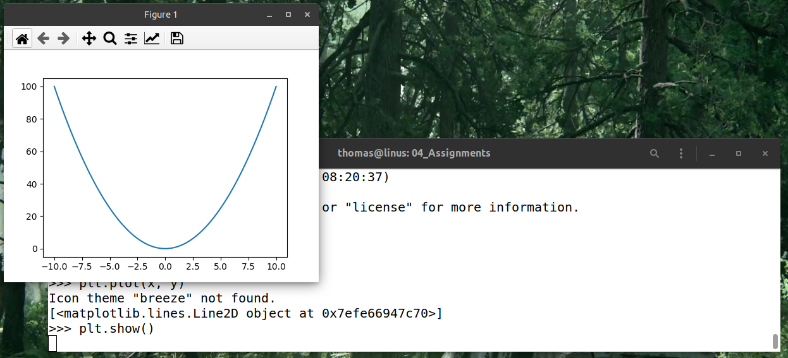

# Python 3.9 unter Ubuntu Linux installieren

## Installation von Python

Python 3.9 sollte bereits als Teil Ihres Betriebssystems installiert sein. Testen Sie dies, indem Sie ein Terminal öffnen und folgendes eingeben:

```console
$ python --version
```

Wenn Sie als Ausgabe `Python 3.9.5` oder ähnlich bekommen, müssen Sie nichts mehr machen und sind fertig. Falls allerdings `Python 2.7.18` oder ähnlich angezeigt wird, zeigt das `python`-Kommando noch auf Python 2. Geben Sie in diesem Fall folgendes in der Konsole ein:

```console
$ python3 --version
```

Wenn Sie als Ausgabe `Python 3.9.5` oder ähnlich bekommen, müssen Sie nichts mehr machen und sind fertig. Allerdings müssen Sie daran denken, dass Sie Python mit `python3` und `pip` mit `pip3` ansprechen müssen. Falls Sie das nicht wollen, geben Sie folgendes Kommando ein:

```console
$ sudo apt update
$ sudo apt install python-is-python3
```

Ab jetzt sollte Python 3 über das `python` Kommando ansprechbar sein.

Wenn bisher noch gar kein Python 3 bei Ihnen installiert ist (was sehr unwahrscheinlich ist), können Sie dies mit dem folgenden Kommando nachholen:

```console
$ sudo apt update
$ sudo apt install python3
```


## Installation von Bibliotheken

Öffnen Sie ein Terminal und geben Sie Folgendes ein:

```console
$ python -m pip install --upgrade pip
```

Falls Sie die Meldung `python: command not found` bekommen oder oben festgestellt haben, dass Ihr Python unter `python3` aufgerufen werden muss, ersetzen Sie `python` durch `python3`.

Im nächsten Schritt installieren Sie die Module im Terminal mit:

```console
$ python -m pip install matplotlib numpy
```

Testen Sie die Installation, indem Sie `python` im Terminal eingeben.

Zum Testen tippen Sie jetzt folgendes ein (`>>>` ist nicht Teil Ihrer Eingabe, sondern das Prompt von Python):

```console
>>> import numpy as np
>>> import matplotlib.pyplot as plt
>>> x = np.linspace(-10,10,1001)
>>> y = x**2
>>> plt.plot(x, y)
>>> plt.show()
```



__GESCHAFFT!!__
