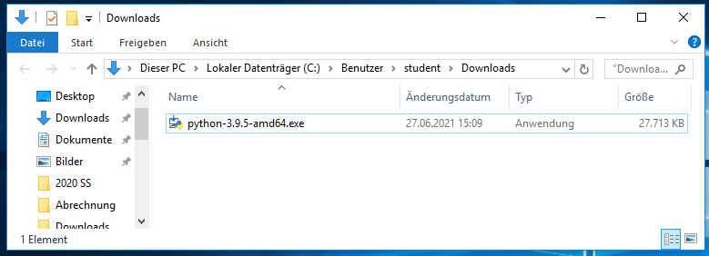
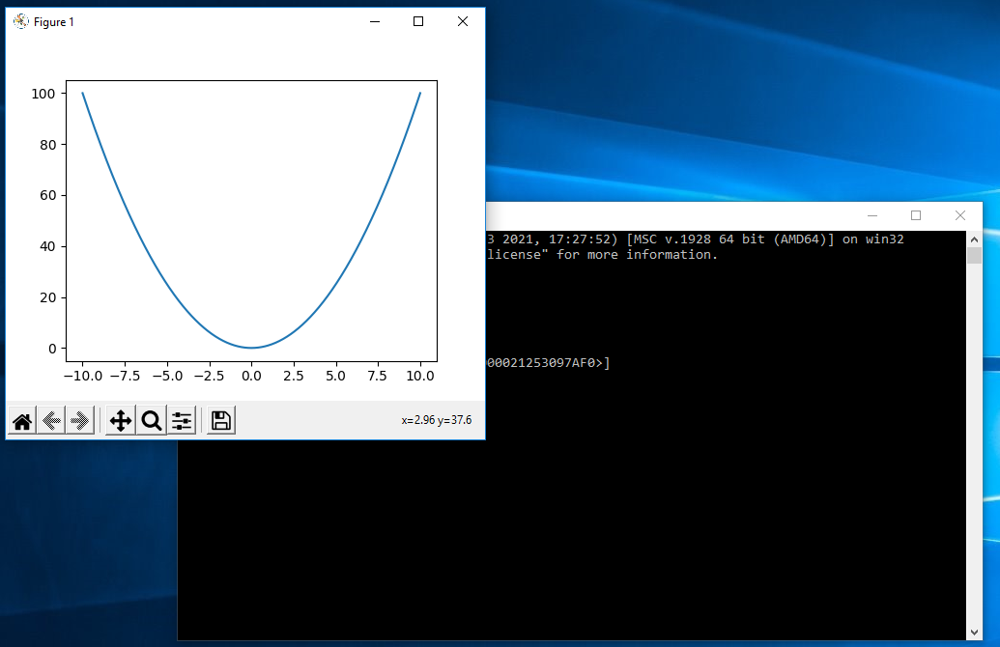

# Python 3.9 unter Windows 10 installieren

Diese Anleitung zeigt Ihnen, wie Sie Python 3.9, inklusive `pip` und der Bibliotheken `matplotlib` und `numpy` unter Windows 10 installieren.

## Download

Gehen Sie auf die [Webseite](https://python.org) `https://python.org` und laden Sie die aktuelle Version von Python für Windows herunter.


Speichern Sie den Download in Ihrem Download-Ordner.


## Installation von Python

Gehen Sie in den Download-Ordner und starten Sie die Installation durch Doppelklick auf die Installationsdatei.



Bestätigen Sie, dass Sie die Datei ausführen möchten.


Wenn Sich der Dialog des Installations-Programms öffnet, setzen Sie einen Haken bei __Add Python 3.9 to PATH__ und klicken Sie dann auf __Customize installation__.


Bei der Anzeige der optionalen Features, sollten alle Häkchen gesetzt sein:

  * [X] Documentation
  * [X] pip
  * [X] tcl/tk and IDLE
  * [X] py launcher
  * [X] for all users (requires elevation)

Klicken Sie auf __Next__.


In den Advanced Options wählen Sie folgendes aus:

  * [X] Install for all users
  * [X] Associate files with Python (requires py launcher)
  * [X] Create shortcuts for installed applications
  * [X] Add Python to environment variables
  * [X] Precompile standard library

Klicken Sie auf __Install__.


Bestätigen Sie, dass Python Änderungne an Ihrem System vornehmen darf.


Die Installation läuft jetzt durch.


Am Ende wird "Setup was successful" angezeigt. Klicken Sie in diesem Dialog auf __Disable path length limit__.


Es erfolgt eine erneute Sicherheitsabfrage von Windows. Die Sie wieder mit __Ja__ bestätigen.


Jetzt wird angezeigt, dass die Installation erfolgreich war. Schließen Sie das Fenster.


## Installation von PIP und den Bibliotheken

Klicken Sie nun auf das Windows-Logo und navigieren See zu __Windows-System__. Klicken Sie auf das Ordnersymbol und klicken Sie dann mit der __RECHTEN__ Maustaste auf __Eingabeaufforderung__. Es erscheint ein Kontextmenü, in dem Sie `Mehr > Als Administrator ausführen` wählen.


Es erscheint eine Sicherheitsabfrage von Windows, die Sie wieder mit __Ja__ bestätigen. Erscheint diese nicht, überprüfen Sie bitte, ob Sie oben wirklich mit der RECHTEN Maustaste geklickt haben (Tipp: Rechts ist da, wo nichts links ist.)


Es öffnet sich die Windows-Eingabeaufforderung im Administratormodus.


Geben Sie folgendes Kommando ein (`C:\Windows\system32>` wird vom System angezeigt und ist nicht Teil Ihrer Eingabe):

```console
C:\Windows\system32> python -m pip install --upgrade pip
```

Sie sehen die Ausgabe, dass `pip` auf die neuste Version gehoben wird.


Geben Sie jetzt im selben Fenster folgendes ein:

```console
C:\Windows\system32> pip install matplotlib numpy
```

Sie sollten die Ausgabe sehen, dass die beiden Bibliotheken installiert wurden.


Schließen Sie das Fenster der Eingabeaufforderung und klicken Sie erneut auf das Windows-Logo.

## Test der Installation
Gehen Sie im Startmenü auf __Python 3.9__, klicken Sie auf das Ordnersymbol und wählen dann __Python 3.0 (64-bit)__ aus.


Es öffnet sich die Python REPL.


Zum Testen tippen Sie jetzt folgendes ein (`>>>` ist nicht Teil Ihrer Eingabe, sondern das Prompt von Python):

```console
>>> import numpy as np
>>> import matplotlib.pyplot as plt
>>> x = np.linspace(-10,10,1001)
>>> y = x**2
>>> plt.plot(x, y)
>>> plt.show()
```

Wenn alles richtig installiert wurde, sehen Sie jetzt einen Plot der Funktion x^2 im Bereich -10 bis 10 auf Ihrem Bildschirm.



__GESCHAFFT!!__