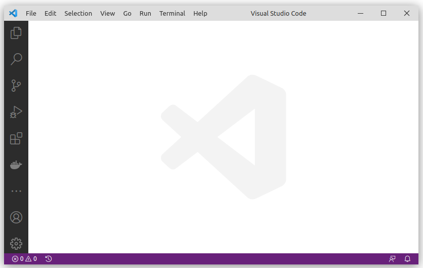
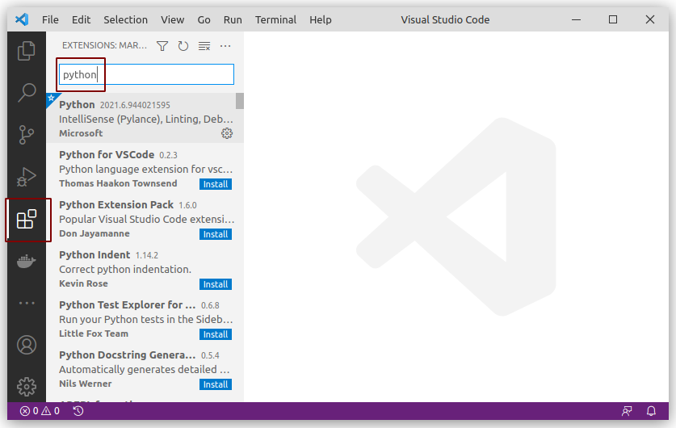
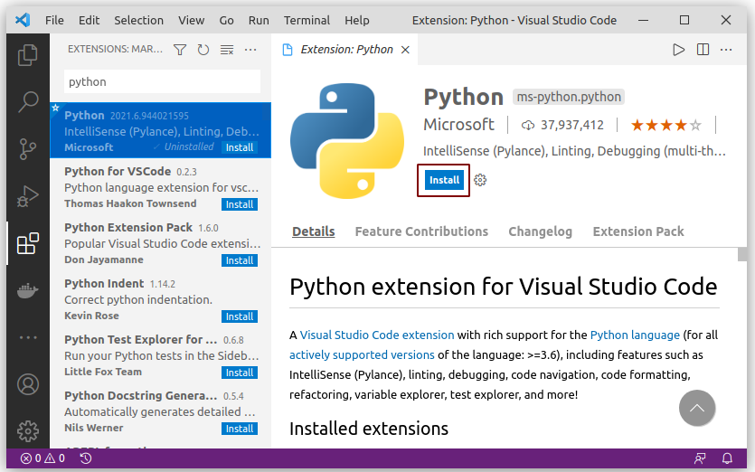
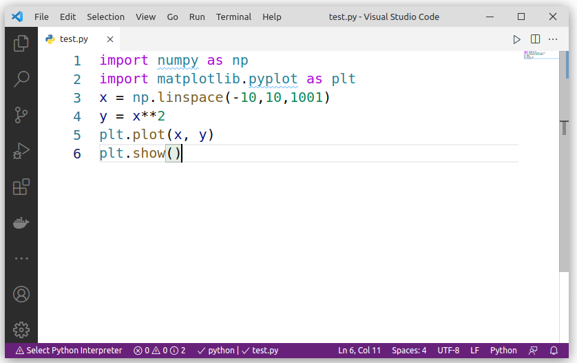
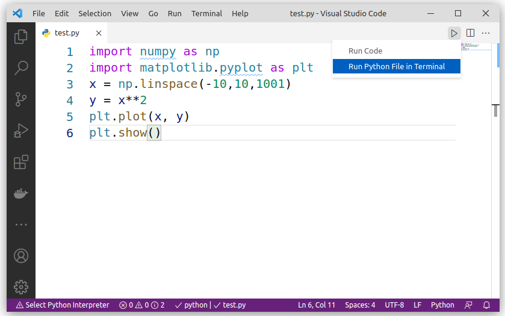
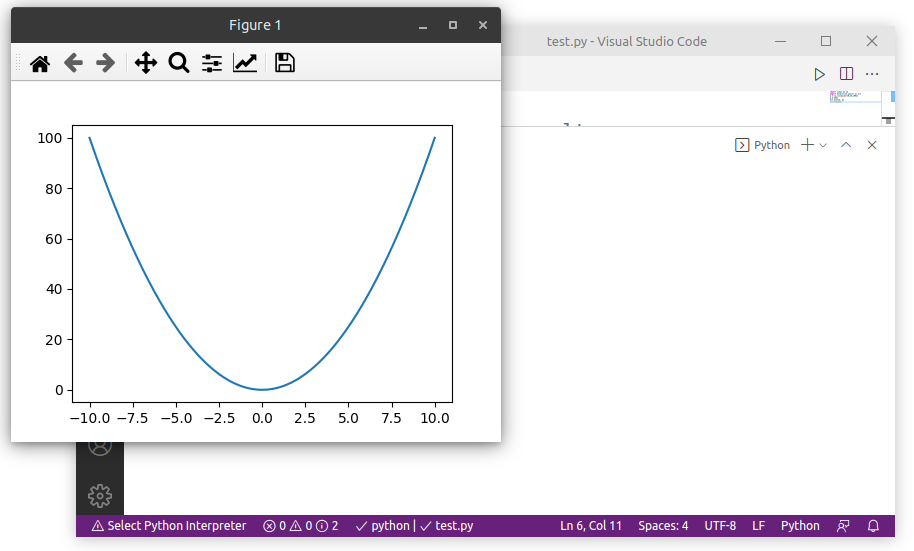

# Visual Studio Code unter Ubuntu Linux

Diese Anleitung zeigt Ihnen, wie Sie Visual Studio Code installieren können. Bitte installieren Sie __vorher__ Python 3.9 gemäß der [Anleitung](python_linux.md).

## VSCode installieren

Visual Studio Code ist als Snap verfügbar und kann daher mit einigen wenigen Kommandos direkt über das Terminal installiert werden. Ein Download ist nicht notwendig.

```console
$ sudo apt update
$ sudo apt install -y snapd
$ sudo snap install code --classic
```


## Visual Studio Code konfigurieren

Starten Sie Visual Studio Code, indem Sie im Terminal `code` eingeben.



Klicken Sie links auf das Symbol mit den vier Quadraten und geben Sie in das Suchfeld `python` ein.



Klicken Sie auf den ersten Treffer und dann auf __Install__.



Wählen Sie __Python__ aus und klicken Sie auf __Install__.

Warten Sie, bis die Installation durchgelaufen ist und schließen Sie dann den Tab __Extension: Python__ durch Klick auf das `X`.


## Test der Installation

Legen Sie mit `File -> New file` eine neue leere Datei an und geben Sie folgenden Inhalt ein:

```python
import numpy as np
import matplotlib.pyplot as plt
x = np.linspace(-10,10,1001)
y = x**2
plt.plot(x, y)
plt.show()
```



Speichern Sie die Datei an einem beliebigen Ort und geben Sie ihr die Dateiextension `.py`, z.B. `test.py`.

Klicken Sie auf den __Play Button__ oben rechts und wählen Sie __Run Python File in Terminal__.



Sie sollten jetzt den Plot einer x^2 Funktion sehen.



Sie haben Visual Studio Code erfolgreich installiert.
