# Visual Studio Code unter Windows 10 installieren

Diese Anleitung zeigt Ihnen, wie Sie Visual Studio Code installieren können. Bitte installieren Sie __vorher__ Python 3.9 gemäß der [Anleitung](python_win10.md).

## Download

Laden Sie Visual Studio Code von der [Webseite](https://code.visualstudio.com) `https://code.visualstudio.com` herunter. Klicken Sie auf __Download for Windows__ und speichern Sie das Installationsprogramm auf Ihrem Rechner.

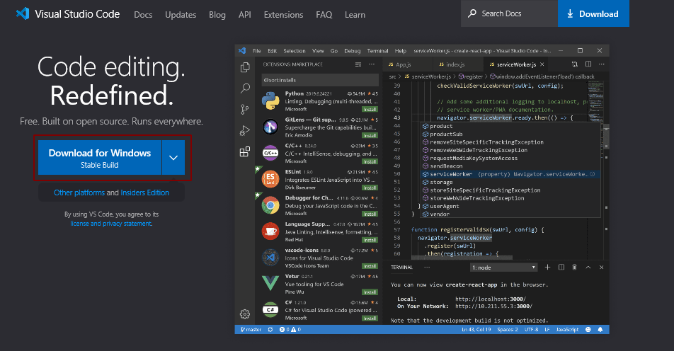
<br>
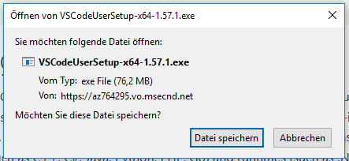

## Installationsprogramm

Führen Sie das Installationsprogramm aus dem Download-Ordner durch Doppelklick aus.

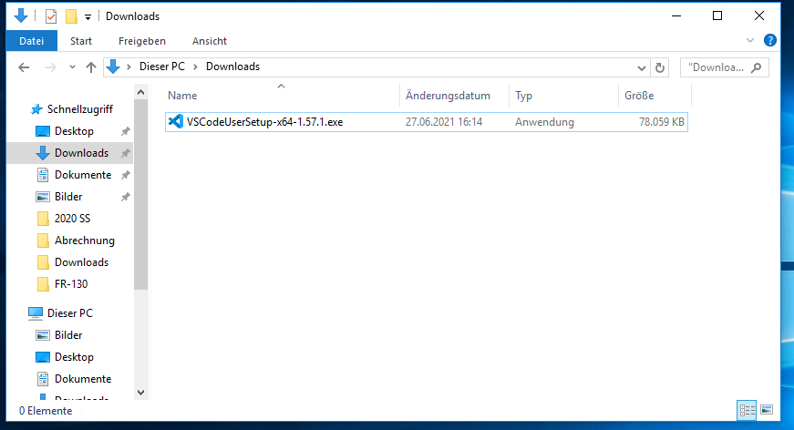<br>
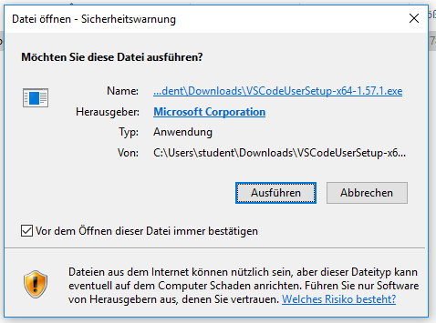

Akzeptieren Sie die Lizenzvereinbarung.
Klicken Sie auf __Weiter__.

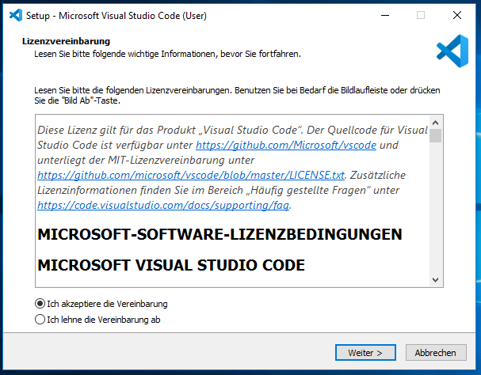

Den Installationspfad und Startmenü-Ordner müssen Sie nicht anpassen. Klicken Sie auf __Weiter__.

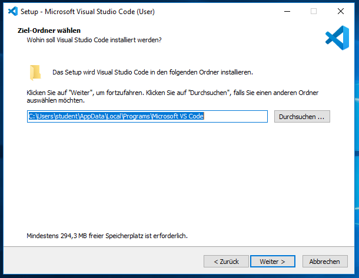
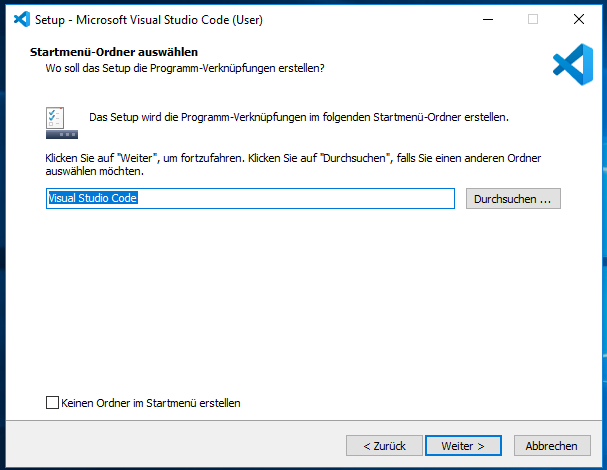

Setzen Sie bei dem Dialog __Zusätzliche Aufgaben wählen__ alle Häckchen. Klicken Sie auf __Weiter__.

  * [X] Desktop-Symbol erstellen
  * [X] Aktion "Mit Code öffnen" dem Dateikontextmenü von Windows-Explorer hinzufügen
  * [X] Aktion "Mit Code öffnen" dem Verzeichniskontextmenü von Windows-Explorer hinzufügen
  * [X] Code als Editor für unterstützte Dateitypen registrieren
  * [X] Zu PATH hinzufügen (nach Neustart verfügbar)


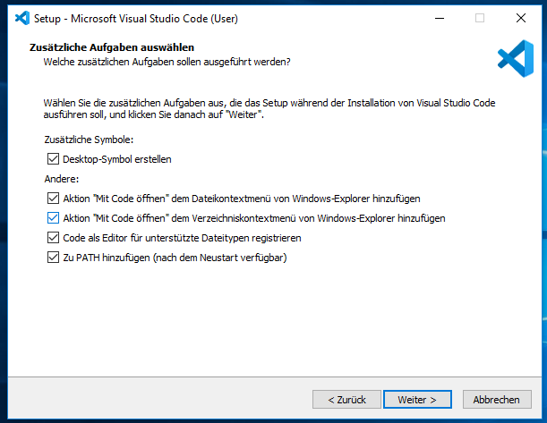

Klicken Sie auf __Installieren__.

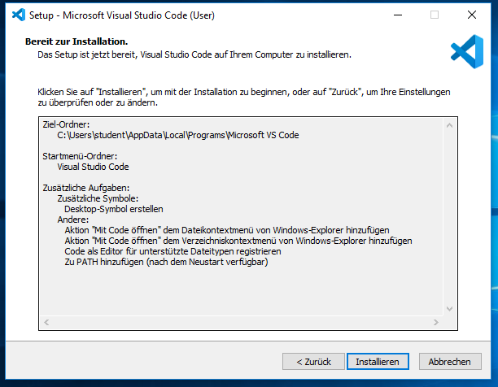

Die Installation sollte jetzt durchlaufen.

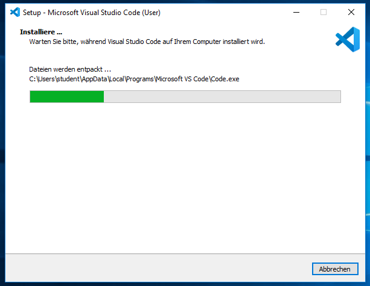

Nach Abschluss des Assistenten setzen Sie das Häkchen bei __Visual Studio Code starten__.

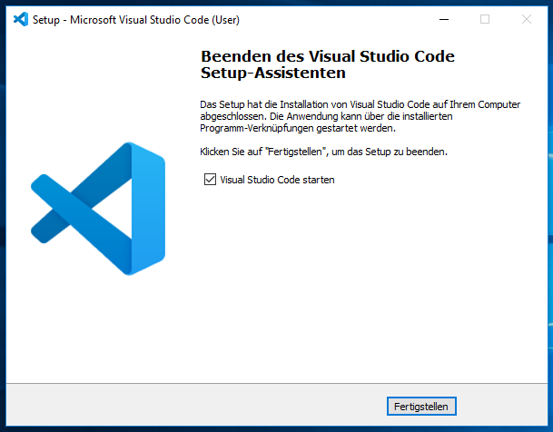

## Visual Studio Code konfigurieren

Visual Studio Code startet. Wählen Sie ein Farbschema, das Ihnen gefällt.

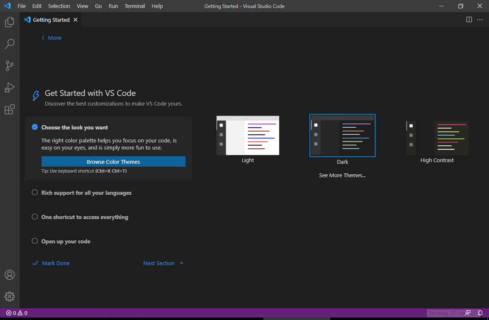

Klicken Sie auf __Browse Language Extensions__.

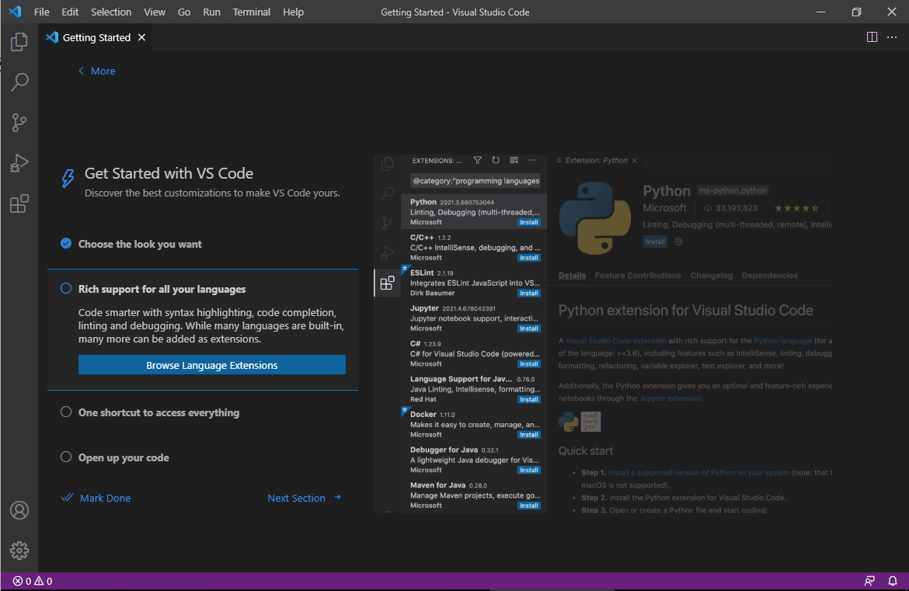

Wählen Sie __Python__ aus und klicken Sie auf __Install__.

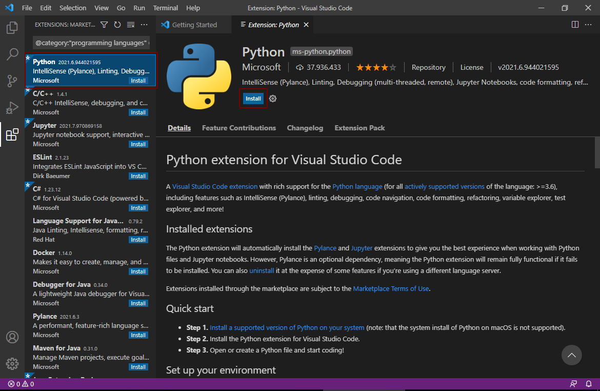

Warten Sie, bis die Installation durchgelaufen ist und schließen Sie dann den Tab __Extension: Python__ durch Klick auf das `X`.

Schließen Sie danach auch den Tab __Getting Started__.

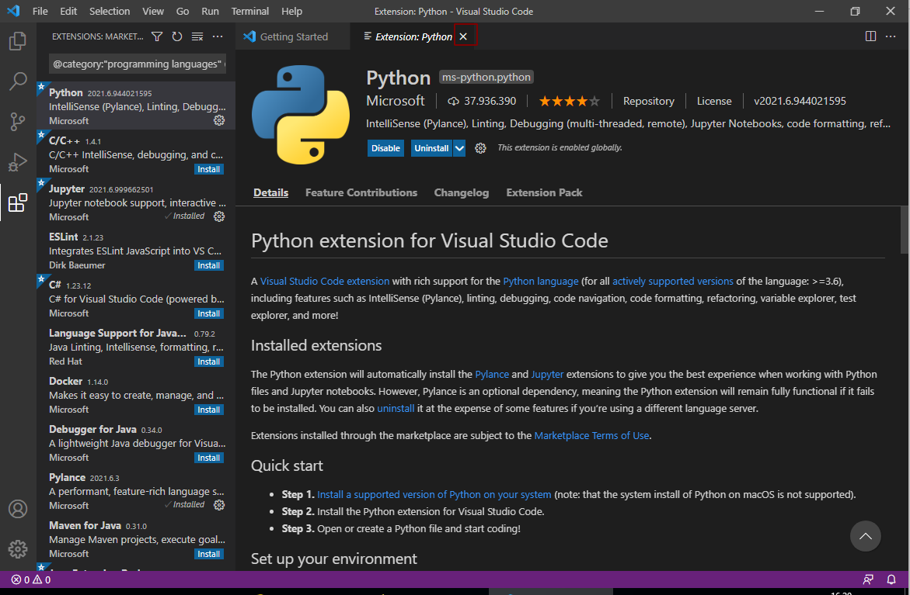

## Test der Installation

Legen Sie mit `File -> New file` eine neue leere Datei an und geben Sie folgenden Inhalt ein:

```python
import numpy as np
import matplotlib.pyplot as plt
x = np.linspace(-10,10,1001)
y = x**2
plt.plot(x, y)
plt.show()
```

Speichern Sie die Datei an einem beliebigen Ort und geben Sie ihr die Dateiextension `.py`, z.B. `test.py`.

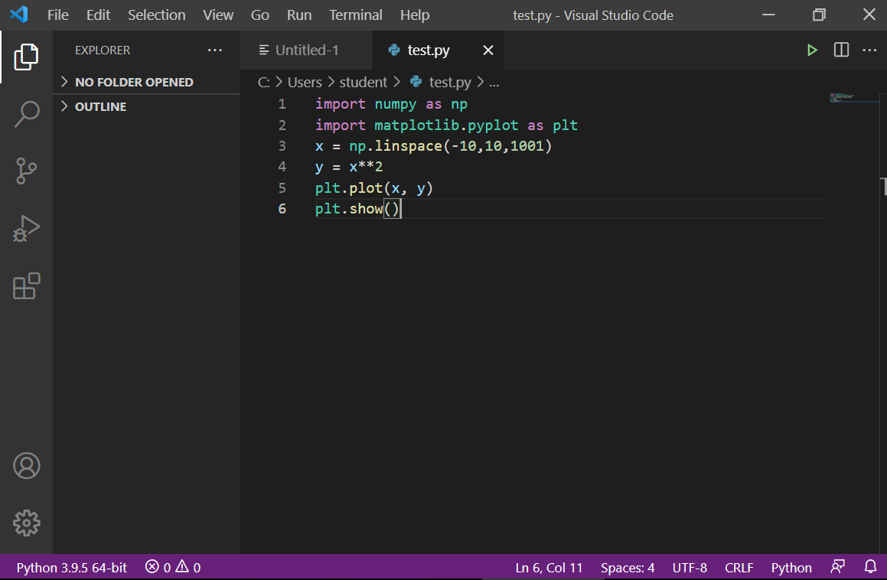

Klicken Sie auf den __Play Button__ oben rechts. Sie sollten jetzt den Plot einer x^2 Funktion sehen.

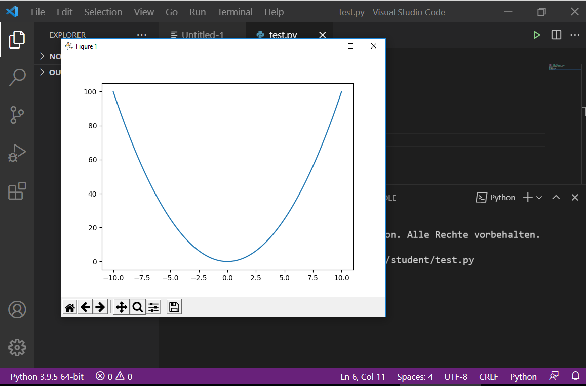

Sie haben Visual Studio Code erfolgreich installiert.
